本文将详细为大家介绍一下如何在本地进行 AREX 的编译和配置。

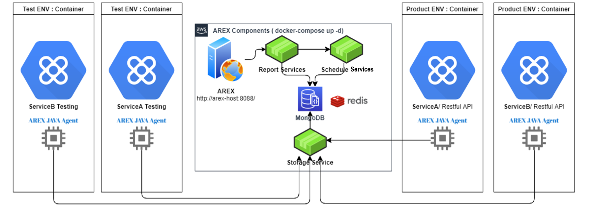
<!--truncate-->

## 背景

[AREX](https://github.com/arextest) 是一款开源的自动化测试工具， 基于Java Agent技术，录制生产环境真实用户的流量，并在测试环境回放流量，同时智能比对分析回放结果，从而实现快速有效的回归测试。除此以外，也提供了用例管理、接口测试（脚本验证、双环境比对）等丰富的自动化测试功能，是一个不需要编程技术，也可快速上手的自动化测试工具平台。

目前你可以通过 Docker-Compose 命令，一键缺省安装 AREX 所有基础服务组件，包括前端 UI，MongoDB 数据库，Redis 缓存，数据存取服务（Storage Service）， 调度服务（Schedule Service），分析服务（Report Service）等（如上图所示）。这种方式不需要手动安装和配置每个服务，大大简化了安装过程，提高部署效率。（详见[文档](https://arextest.github.io/website/zh-Hans/docs/intro/)）

当然，你也可以通过在本机上构建 Docker 镜像的方式在本地对各个服务组件进行编译和安装。这种方式适用于需要对单个服务进行开发和测试的场景，可以避免安装不必要的依赖项，同时也适用于需要在离线环境下部署的场景。

本文将详细为大家介绍一下如何在本地进行 AREX 的编译和配置。（如果你有其他特殊的部署需求或建议，也可以在[ GitHub Issue](https://github.com/arextest/deployments/issues) 中提出）

## 本地构建 Docker 镜像

首先，创建 github-arex 目录，用于存放 AREX 各个服务组件。建议将 AREX 各个项目放在同一个目录下，[Deployment 仓库](https://github.com/arextest/deployments/)中 Shell 脚本都是以相对路径来进行访问的，如果目录路径发生变更，也需要同步修改 Shell 脚本中的相关配置。

### 下载 AREX Deployment 仓库

Deployment 仓库中包含编译命令、[Dockerfile](https://github.com/arextest/deployments/tree/dev/dockerfile)（用于构建镜像，包含了构建镜像所需的指令和依赖项） 和 [Docker-Compose file](https://github.com/arextest/deployments/blob/dev/docker-compose.yml)（用做容器编排进行环境部署）等文件，编译时需要切换至 dev 分支。

```shell
cd github-arex
git clone https://github.com/arextest/deployments.git
cd deployments
git checkout dev # 切换到代码仓库的 dev 分支，并将当前工作目录中的代码更新为 dev 分支的最新版本
```

### 下载编译 AREX 前端 UI

AREX 前端 UI，是交互组件，主要负责用户配置执行的交互界面。

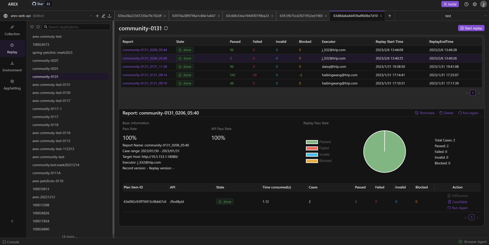

```shell
cd github-arex
git clone https://github.com/arextest/arex.git
cd arex-front-end
git pull --rebase
cd ../deployments
./front.build.sh # 执行 front.build.sh 脚本，构建 AREX 前端 UI 组件 
cat front.build.sh # 查看脚本
cat dockerfile/front.Dockerfile # 查看 Dockerfile 配置
```

`front.build.sh` 脚本如下所示，执行时会复制 Dockerfile 并执行 `docker build` 命令来根据 Dockerfile 构建 Docker 镜像，其中版本编号可以根据实际情况进行修改。

```shell
cd ../arex-front-end 

cp ../deployments/dockerfile/front.Dockerfile ./Dockerfile # 将 front.Dockerfile文件复制到当前目录，并命名为 Dockerfile 
docker build -t arexadmin01/arex:0.2.6  .  --build-arg http_proxy=http://ntproxy.qa.nt.ctripcorp.com:8080 --build-arg https_proxy=http://ntproxy.qa.nt.ctripcorp.com:8080 # 使用 Dockerfile 构建名为 arexadmin01/arex:0.2.6 的 Docker 镜像，并指定了 http_proxy 和 https_proxy 参数，以便能够通过代理加速镜像下载
rm -rf ./Dockerfile # 构建完成后删除 Dockerfile 

cd ..
```

注: 如修改版本编号，还需要对 Docker-Compose file（docker-compose.yml）中的版本编号进行同步修改。

`front.Dockerfile` 文件如下所示，其中包含 Nodejs 中 npm 的安装和端口暴露（8080）等。

```dockerfile
FROM node:14.18.1 # 使用 node:14.18.1 作为基础镜像
# Create app directory 
WORKDIR /usr/src/app 

# Install app dependencies 
# A wildcard is used to ensure both package.json AND package-lock.json are copied 
# where available (npm@5+) 
# COPY package*.json ./ 
COPY . . 

RUN npm install  --loglevel verbose // 安装依赖 
RUN npm run build // 构建项目 

# Bundle app event 
# COPY . . 

EXPOSE 8080 // 暴露容器端口 8080 
CMD [ "node", "server.js",">","./logs/app.log","2>", "./logs/error.log"] // 使用 Node.js 运行 server.js，并将日志输出到 ./logs/app.log 和 ./logs/error.log 中
```

注意：如果不使用 Docker 进行安装，也可直接编译运行。这种方式适用于不需要使用 Docker 进行环境隔离和容器化的场景。其他服务组件也可通过这种方式直接编译运行，后续这部分不再赘述。

### 下载编译 AREX 数据存取服务

AREX 数据存取服务（Storage Service）主要负责存储 Agent 的录制数据，获取回放数据，以及录制回放配置的读取 。

```shell
cd github-arex 
git clone https://github.com/arextest/arex-storage.git
git pull --rebase
cd ../deployments
./storage.build.sh # 执行 storage.build.sh 脚本，构建 AREX 数据存取服务组件 
```

### 下载编译 AREX 调度服务

AREX 调度服务（Schedule Service）是调度组件，用于协调 AREX 执行回放任务的过程以及回放结果比对。当 AREX 执行回放任务时，调度服务通过 Storage Service 服务从数据库中提取被测应用的录制数据（请求），然后向目标验证服务发送接口请求。一旦服务接收到请求，便会处理请求逻辑。同时，由 Agent 装载需要 MOCK 的外部依赖数据，处理完成后返回响应报文。调度服务会将录制的响应报文与回放的响应报文进行比对，并将比对结果推送给分析服务，用于后续的回放报告生成。

```shell
cd github-arex 
git clone https://github.com/arextest/arex-replay-schedule.git
git pull –rebase 
cd ../deployments 
./schedule.build.sh # 执行 schedle.build.sh 脚本，构建 AREX 调度服务组件 
```

### 下载编译 AREX 分析服务

AREX 分析服务（Report Service）是分析组件，负责分析录制数据、回放结果，生成回放报告，以及处理用例管理逻辑。

```shell
cd github-arex 
git clone https://github.com/arextest/arex-report.git
git pull -rebase 
cd ../deployments 
./ report.build.sh # 执行 report.build.sh 脚本，构建 AREX 分析服务组件
```

### 下载编译 AREX Community Test

**AREX Community Test** 是由 AREX 社区提供的用来验证功能的一个模拟服务，你可以用它来试用 AREX 的流量录制回放功能。

```shell
cd github-arex 
git clone https://github.com/arextest/arex-commuty-test.git
git pull –rebase 
cd ../deployments 
./ community.build.sh # 执行 community.build.sh 脚本，构建 AREX Community Test 服务
```

### 下载编译 AREX Java Agent

AREX Java Agent 是录制回放组件，负责 Java 应用的数据录制及回放过程中的数据 Mock，在被测应用的后台执行。录制过程中，Agent 会记录 Java 应用的数据流量和请求信息，并将这些信息存储在数据库中。回放过程中，Agent 会将录制的外部依赖（外部请求/DB）的响应返回给被测应用，从而实现 Mock 的效果。

```shell
cd github-arex
git clone https://github.com/arextest/arex-agent-java.git
git pull –rebase
cd ../ arex-agent-java/
mvn clean package # 进行清理并打包，以便于部署和运行
```

编译完成：

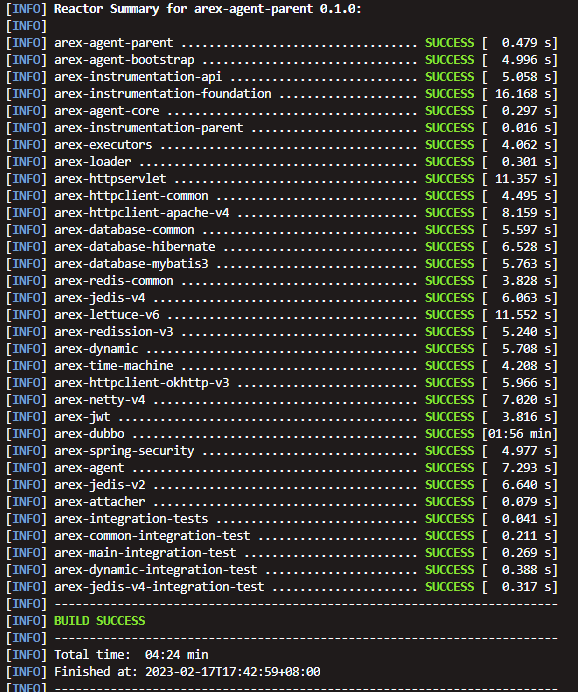

执行 `ls arex-agent-jar/` 命令，即可查看生成的最新的 Java Agent 文件，如下图所示：

 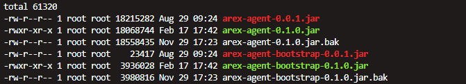

### 下载编译 AREX 批量执行测试用例服务（Node Service）

**Node Service** 是测试用例的脚本执行服务，负责在 Collection 模块中用例的前置脚本和验证脚本的执行。

```shell
cd github-arex
git clone https://github.com/arextest/arex-node-service.git 
cd arex-node-service/ 
git pull --rebase 
cd ../deployments 
./node.build.sh
```

如下图所示，所有组件均已编译完成。

 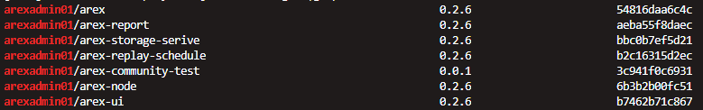

如果需要对 AREX 整个系统中的某个组件进行单独配置，可以通过修改配置文件 Docker-Compose file 中的配置项来完成。

以下将对如何修改各个服务组件的配置展开详细介绍，如修改数据库配置、服务端口配置等。完成修改后，AREX 系统中就可以按照你的需求来运行。

## 单独配置各个服务

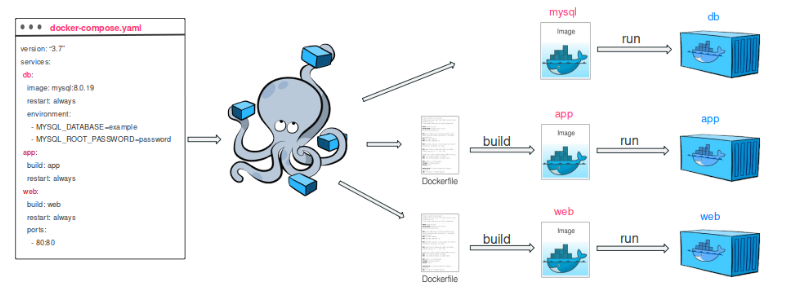

Docker Compose 是用于定义和运行多容器 Docker 应用程序的工具，使用 Compose 可在一台主计算机上方便地协调多个容器映像。 在 Docker Compose 中，通常会使用一个配置文件 docker-compose.yml 来配置应用程序的服务。 通过修改配置文件中的各个配置项，可以更加灵活地运行 AREX 中的每个服务。配置完成后，只需运行一条命令，即可从配置中创建并启动所有服务。 

```shell
cd github-arex 
git clone https://github.com/arextest/deployments.git 
cd deployments 
cat docker-compose.yml
```

### 配置 AREX 前端 UI

配置文件中关于 AREX 前端 UI 部分的详细配置见下图：

 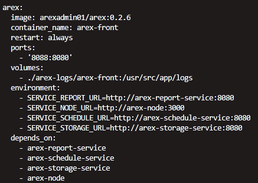

其中：

1. AREX 前端服务配置的端口是 8080，通过 Docker 容器对外暴露的端口是 8088，用户可以根据需要修改；
2. 日志存储在当前目录下的 arex-logs/arex-front 目录下。
3. AREX 前端服务依赖于四个服务
   1. 分析服务（arex-report-service），用于获取分析数据；
   2. 调度服务（arex-schedule-service），用于前端触发回放操作等调用；
   3. 数据存储服务（arex-storage-service），用于读取配置等操作；
   4. Node 服务，用于实现批量执行测试用例。

### 配置 AREX Node服务

Node 服务是一个简单服务，内部端口 3000， 对外暴露端口 10001，一般不涉及外部调用，此处可忽略。

### 配置 AREX 分析服务

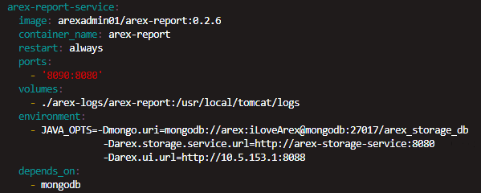

1. AREX 分析服务依赖于 Mongodb 数据库，需要连接 MongoDB 数据库进行数据存储和查询，用户名和密码是 MongoDB 的配置。如果用户使用自己的 MongoDB 服务，需要将连接信息改为自己的 MongoDB 配置。
2. 依赖于 Storage 服务，不需要修改此部分，如果独立部署，需要修改地址和端口。
3. AREX 分析服务的内部端口是 8080，通过 Docker 容器对外暴露的端口是 8090。

注意：`Arex.ui.url` 是一个特殊的配置项，它用于在 AREX 邮件服务中组装登录链接。因为 AREX 的登录需要用户输入邮箱，而邮件服务发送的链接需要指向可访问的 AREX 前端地址，因此必须将 `Arex.ui.url` 配置为实际的前端地址，而不是 Docker-Compose 中容器的地址。如果配置不正确，邮件通知中的链接将会跳转到错误页面。

### 配置 AREX 数据存储服务

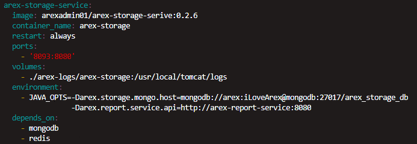

1. 数据存储服务内部端口 8080， 对外暴露端口 8093。
2. 数据存储服务依赖于：
   1. mongodb 数据库，配置方式同上一节；
   2. Redis 缓存，用于录制和回放中存储缓存，加速性能；
   3. 分析服务

### 配置 AREX 调度服务

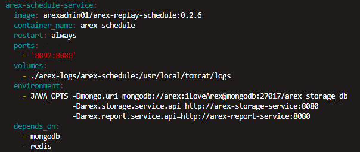

1. AREX 调度服务内部端口 8080，对外暴露端口8092。
2. 与数据存储服务基本一致，AREX 调度服务同样依赖于：
   1. mongodb 数据库；
   2. Redis 缓存；
   3. 分析服务。

###  配置 Redis 缓存服务

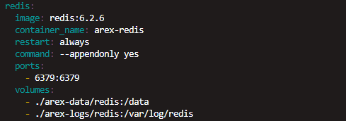

Redis 实例，内部端口 6379， 对外暴露端口 6379。

如果选择使用其他环境中的 Redis 服务，则需要删除 Docker-Compose 文件中 Redis 服务节点的配置，并将所有依赖服务中的相关配置修改为连接到已有的 Redis 服务。

### 配置 MongoDB 数据库服务

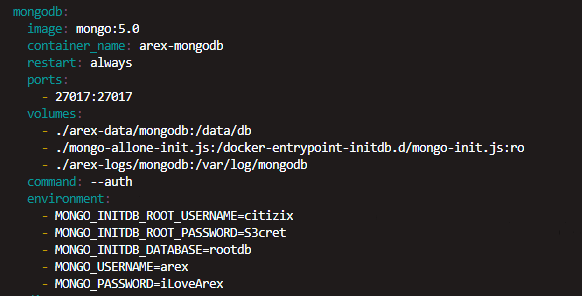

数据库服务内部端口 27017，对外暴露端口 27017。

同上，如果选择使用其他环境中的数据服务，则需要删除配置文件中 MongoDB 服务节点的配置，并将所有依赖服务中的相关配置修改为连接到已有的数据库服务。

`mongo-allone-init.js` 是服务启动过程中的依赖的一个配置文件，用于初始化 MongoDB 数据库的一些配置。如下：

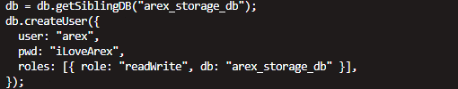

数据存储在当前目录的 arex-data/mongodb 目录中。

## AREX Docker Compose 启动

所有配置调整好后， 启动 AREX 服务：

```
docker-compose up –d
```

停止 AREX 服务：

```
docker-compose down –v
```

查看日志：

```
docker-compose logs
```

logs 命令用来查看服务进程状态， 当 State 出现问题时，可以使用 logs 命令来调试跟踪。

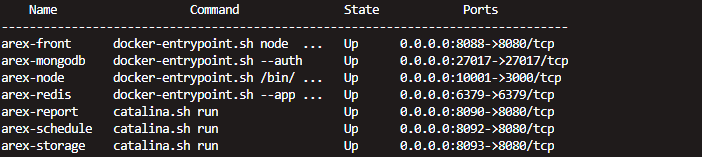
