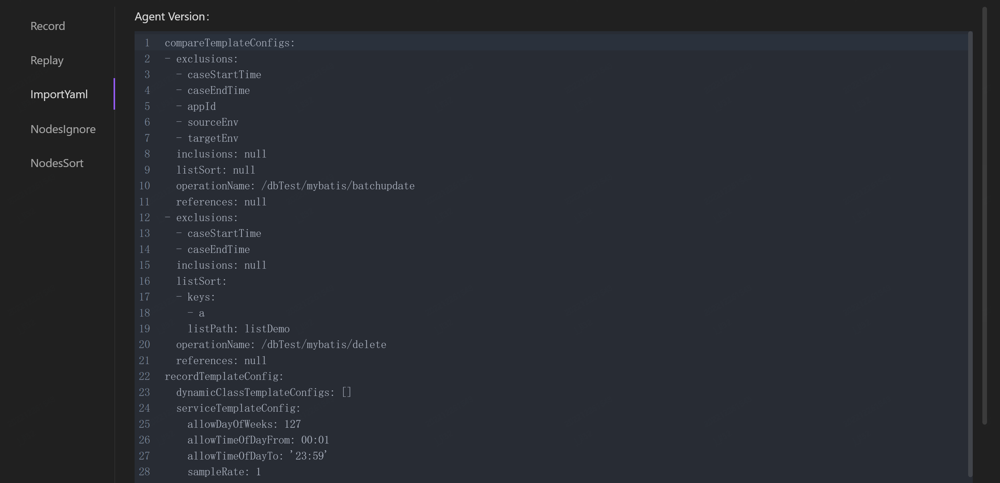
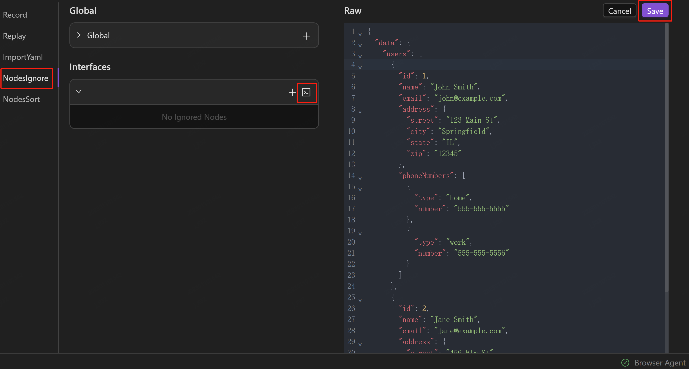

Traffic recording and replay is done by recording your live traffic and then reusing it(replaying) in the testing environment for testing the correctness of code logic.

It is often used for regression testing and has a number of advantages:

- Through recording traffic, with low cost in creating cases;
- Perfectly simulating user behavior by replaying real traffic from the production environment, avoiding the discrepancies that may occur from manual writing;
- Additionally, a more in-depth and fine validation of system logic can be achieved by comparing the recorded data and replayed data in an object-by-object manner;
- The recorded traffic is readily available for use, and does not require maintenance, making it extremely convenient.

## Record your appication

AREX Agent is the core component for implementing service recording and playback. To use the recording function, the Agent must be configured in the tested application, see for [**Deploy AREX Agent**](Quick%20Installation#deploy-arex-agent).

Once configured, you can access the AREX UI through Chrome browser, select the **Replay** tab, and then you will see your applications to be tested in the right-side.

By default, AREX automatically records all online traffic, but you can customize recording tasks in **AppSetting**.

## AppSetting

Select the **AppSetting** tab in the sidebar. The list shows all the recorded applications. Select one app to set it.

### Recording setting

You can periodic record the live traffic for specific time periods according to your needs. Select **Record** tab to enter the recording settings page.

#### Basic setting

**Duration**：Select the day to record the application, you can choose to record every day, or just for any days of the week.

**Period**：Select the time period from 00:00 ~ 24:00 for daily recording.

**Frequency**：Select the recording frequency from "1~100", with a unit of "times/100 seconds", meaning the number of recordings per 100 seconds.

#### Advanced setting

AREX provides a very comprehensive Mock feature. Not only basic dependency data can be mocked, time and local cache type data can also be mocked.

**Time Mock**：As many business systems are time sensitive, different time access will often return different results. In this case, you can select **Time Mock**, and then the time will also be mocked during the recording process, to ensure that the replay results will not be different due to the time.

**Dynamic Classes**：In actual on-line applications, various caches are used to improve runtime performance. To avoid inconsistencies in the execution results caused by differences in cache data, AREX can also collect and mock these local cache data. The implementation method is to configure the method of accessing the local cache as a dynamic class, which is equivalent to customizing the method for mocking. It will record the data of the dynamic class method you configured in the production environment, and playback the corresponding matching data returned. Besides cache data, various memory data can also be mocked. If there is a need for mocked dynamic class data, click "+ Add" to configure. The specific configuration instructions are as follows:

- FullClassName: The full class name of the local cache, such as java.lang.String.
- MethodName: The method name to be mocked.
- ParameterTypes: The full class names of all parameters, separated by "@". Primitive types can be abbreviated, such as int.

### Replay setting

Select **Replay** tab to enter the replay settings page.

**Case range**：Select the duration for replaying the recorded cases of Continuous Integration (CI), and the unit of measurement is in "days".

**Exclude Operation**：If there are some paths that you don't want to compare, you can select "**+ Add**" to add these paths to ignore. And then these paths will be skipped during replay, which will improve the success rate of replay.

### Configure with Yaml file

The above configuration for recording and replay can also be configured directly by importing Yaml configuration files.

### Nodes Ignore

If there is data such as timestamp, random numbers, IPs in the response, even if the code does not change, there will be discrepancy points in the comparison result. In this case, you can pre-configure these nodes to be ignored to reduce interference.

**Global**：You can add the global ignore nodes of this application, just select "**+**" to add the key to be ignored. Once you set, all the interfaces within this application will automatically skip the comparison of this node during replay.

**Interfaces**：You can add ignore nodes for individual interfaces under the application.

1. Select the edit icon, enter the response returned from this interface request and select **Save**.

    

2. All the nodes in the response will be displayed under this interface. Simply select the nodes you want to ignore.

    

### Nodes Sort

Usually, an array in the response contains multiple elements, and the order of elements in the responses returned from two different request URLs often differs, resulting in differences in comparison results even though the returned response are actually the same.

By configuring the keys of the elements in the array in **Nodes Sort** tab, we can avoid the failure of comparison due to different ordering of the elements in the array of the response during the matching process.

1. Select the edit icon, enter the response from this interface manually, and select **save**.

    

2. After saving the response, the interface will automatically display all nodes of the response (only arrays can be sorted). Click the **+** icon, select one or more keys under the array, and click "Save" to save. Take note, you may choose a key group that can uniquely identify the array element.

    

    

    And then AREX will no longer compare elements one by one in the order of the array elements during replay, but will find the same element in the two sets of response through the previously set key group and compare them one by one to avoid differences due to inconsistent element order.

    **For example**：As shown below, the `users` array contains multiple elements, and after the request is sent, the order of the two elements with `id` of `1` and `id` of `2` in the return result is random. Without **Nodes Sort**, it will compare the first element in `users` array (the `id` is `1`) of recorede response with the first element in the same array (the `id` is `2`) of the replay response, resulting in a failue of replay.

    
    
    So you need to check both `id` and `name` as the unique identifier of this `users` array element, and the same element will be found in the recorded and played back response messages by `id` and `name` for comparison during playback. If only `name` is checked as the identifier, the playback will still fail if there is an identical name.
    
    Similarly, the `phoneNumbers` array in this array can be configured by checking `type`.
    
    In the response message shown below, the users array has multiple elements and their order of the two elements with `id=1` and `id=2` is unpredictable after the request is sent. The first element in the response users array (with `id=1`) is compared to the first element in the playback response users array (with `id=2`), leading to a replay failure.

    
    
    You should select both `id` and `name` as the unique identifier of this `users` array element, and the same element will be found in the recorded and replayed response messages by `id` and `name` for comparison during replay. If only `name` is selected as the identifier, there will still be differences in the comparison result in case of the same name, leading to a replay failure..
    
    Similarly, the `phoneNumbers` array in this array can be configured by selecting `type`.
