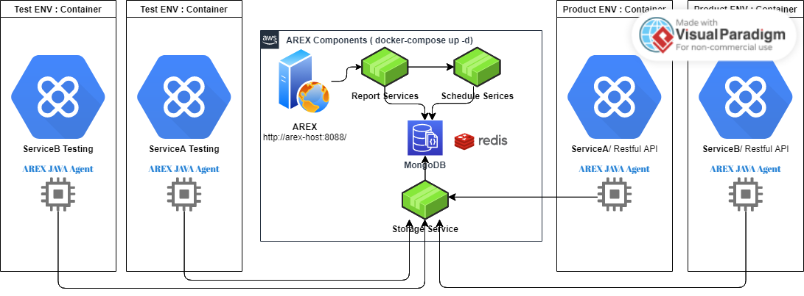
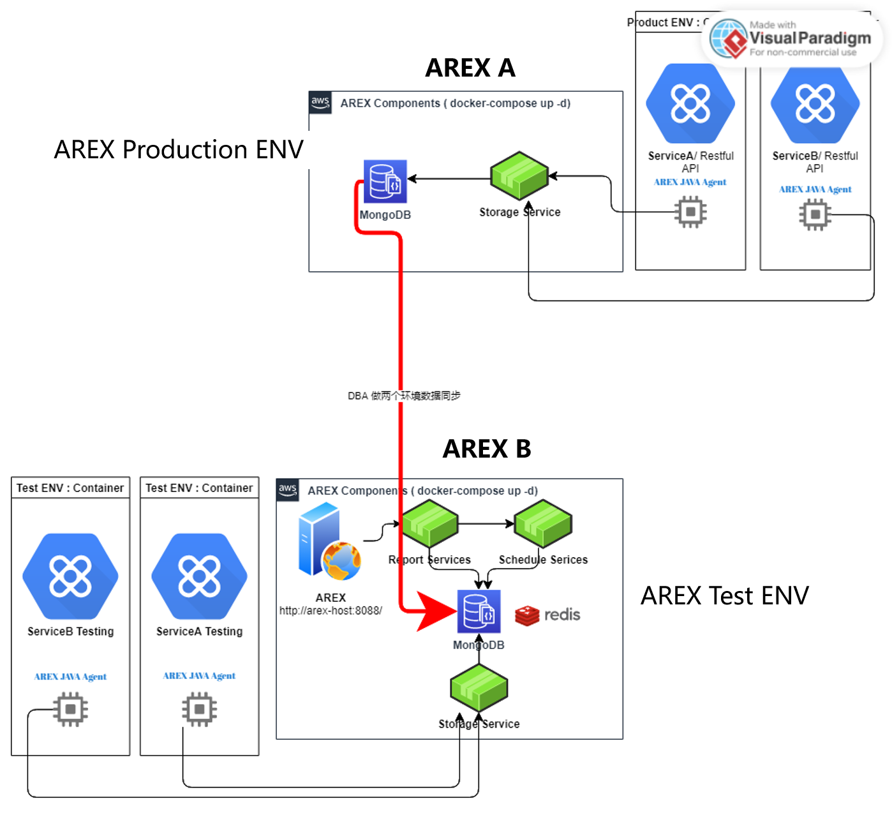

## Pre-preparation

Before you start with AREX, make sure you have the following tools installed:

`Docker` and `Docker Compose`.

## Install AREX

To get started, you can install AREX with Docker.

First clone the `deployments` repostiory:

```shell
git clone https://github.com/arextest/deployments.git 
cd deployments
```

Now you can use `docker-compose` to start AREX.

```shell
docker-compose up -d
```

After installation, all components including **Front-End**, **Services**, **Database** will be installed automatically, with only one instance of each component, as follows:

| ID   | Number of Instance | Model Name                                                   | Description                                                  |
| ---- | -------- | ------------------------------------------------------------ | ------------------------------------------------------------ |
| 1    | 1        | [Schedule Service](https://github.com/arextest/arex-replay-schedule) | A set of schedule APIs that provide replay send and retrieve all responses for comparison. |
| 2    | 1        | [Replay Report Service](https://github.com/arextest/arex-report) | A set of report APIs that provide difference summaries and show the difference result details after the responses are compared. |
| 3    | 1        | [Storage Service](https://github.com/arextest/arex-storage)  | A set of remote storage APIs that provide [Agent Hook Service](https://github.com/arextest/arex-agent-java) to save records and get responses as mocks. |
| 4    | 1        | [Front-End](https://github.com/arextest/arex-front-end)      | A visual web site that provide entry to all operations in your **AREX**. |
| 5    | 1        | MongoDB                                                      | 数据存储及配置管理数据库                                     |
| 6    | 1        | Redis                                                        | 高速回放缓存                                                 |

You can check the status and ports of each service by running the command `docker-compose ps` on the host running Docker.

```shell
[~ deployments]# docker-compose ps   
Name            Command                           State         Ports 
------------------------------------------------------------------------------------------ 
arex-front      docker-entrypoint.sh node  ...    Up      0.0.0.0:8088->8080/tcp 
arex-mongodb    docker-entrypoint.sh --auth       Up      0.0.0.0:27017->27017/tcp 
arex-redis      docker-entrypoint.sh --app ...    Up      0.0.0.0:6379->6379/tcp 
arex-report     catalina.sh run                   Up      0.0.0.0:8090->8080/tcp 
arex-schedule   catalina.sh run                   Up      0.0.0.0:8092->8080/tcp 
arex-storage    catalina.sh run                   Up      0.0.0.0:8093→8080/tcp
```

Check all service log:

```shell
cd deployments 
docker-compose logs
```

Check AREX logs:

```shell
docker-compose logs arex
```

Check **Schedule Service** log:

```shell
docker-compose logs arex-schedule-service
```

Check **Report Service** log:

```shell
docker-compose logs arex-report-service
```

Check **Storage Service** log:

```shell
docker-compose logs arex-storage-service
```

## Next steps

### Deploy AREX Agent

**AREX Agent** is the core component for applications recording and replay. You can run AREX Agent by configuring `-javaagent` to dynamically inject the agent into the JVM.

The operation of AREX Agent depends on the **Storage Service** of AREX.([AREX storage service](https://github.com/arextest/arex-storage))。

First clone the `arex-agent-java` repostiory:

```shell
git clone https://github.com/arextest/arex-agent-java.git 
cd arex-agent-java 
mvn clean install
```

Then you will get a new folder named `arex-agent-jar` in the `arex-agent-java` folder, which contains two jar packages.

AREX Agent can be deployed by the different methods listed below:

#### Configure Java Parameters

Set the host and port of the two dependent services:

```shell
java -javaagent:/path/to/arex-agent-<version>.jar
     -Darex.service.name=your-service-name
     -Darex.storage.service.host=<storage.service.host:port> //(The host IP of `deployments` after deployment in docker and the port of AREX storage service)    
     -jar your-application.jar
```

:::note

- `arex-agent.jar`: the name of the jar package provided by AREX or compiled by yourself, note the modified path
- your-service-name: the name of your tested service, different names for different services
- your-application.jar: the jar package of your tested service

:::

#### With Configuration file

You can create a new configuration file `arex.agent.conf` as shown below:

```conf title="arex.agent.conf"
arex.service.name=your-service-name  
arex.storage.service.host=<storage.service.host:port> 
```

Then configure Agent by running:

```shell
java -javaagent:/path/to/arex-agent-<version>.jar     
     -Darex.config.path=/path/to/arex.agent.conf     
     -jar your-application.jar
```

#### Set JAVA_OPTS variable

You can deploy AREX Agent with Tomcat by configuring `catalina.sh` file and set the `JAVA_OPTS` variable, or you can configure it directly in the environment variables. Here is an example of how to do this on Linux:

```shell
export JAVA_OPTS=-Djavaagent:/path/to/arex-agent.jar -Darex.storage.path=/path/to/arex.agent.conf
```

You can then run Tomcat as usual. The AREX Agent will be automatically injected into the JVM and run when Tomcat starts.

#### Local mode via ArexCli

Run the local mode with ArexCli:

```shell
chmod 550 bin/arex-cli.sh 
cd ./bin/ 
./arex-cli
```

You can also run:

```shell
git clone https://github.com/arextest/arex-agent-java.git 
cd arex-agent-java 
mvn clean install 
java -cp ".
```

Successful execution:


The supported commands:

- **record**: Record data or set the recording rate.

  - `[option: -r/--rate]` set record rate, default value 1, record once every 60 seconds
  - `[option: -c/--close]` shut down record

- **replay**: Replay and compare differences with the recorded data.

  - `[option: -n/--num]` replay numbers, default the latest 10

- **watch**: Watch the replay results and differences.

  - `[option: -r/--replayId]` replay id, multiple are separated by spaces

- **debug**: Debug specific cases locally.

  - `[option: -r/--recordId]` record id, required Option

Note: In local mode, AREX uses [H2](https://www.h2database.com/) as a local storage to save test data, and no longer relies on the storage service. In addition, you will not be able to use the AREX UI interface.

## AREX Deployment Solutions

### Deploy Single AREX Service

If the recording and replay environments, i.e. the production and test environments, can communicate with each other, you could just deploy one AREX service. As shown in the following diagram, data is recorded in the production environment, stored in AREX (Mongodb), and then replayed in the test environment.



### Deploy Multiple AREX Service
If the production environment and the test environment cannot communicate with each other, i.e. the recording environment and the replay environment are isolated from each other and the test environment cannot access the database in the production environment, then multiple AREX services need to be deployed.



#### Deployment Process

1. Deploy AREX A in the production environment for recording on-line traffic in the production environment and storing it in AREX (Mongodb).
2. Deploy AREX B in the test environment for replaying the recorded traffic in the test environment.
3. The DBA synchronizes the database data from AREX A to AREX B in a one-way manner.
4. AREX A records on-line traffic from the producion environment, while AREX B replays the traffic in the test environment.

## Update

First, enter the path where the `docker-compose.yml` file is located. You may need to manually stop all the dependent services before updating. For example, the configuration service has been removed in version 0.2.4, updating while the configuration service is still running will cause the update to fail.

```shell
cd deployments 
docker-compose down -v
```

Note: If you do not want to retain the original Mongodb data or logs, just delete the arex-data and arex-logs directories in the current running directory manually(please be careful, as deletion cannot be undone).

Update the deployments repository by pulling the latest version and start AREX again by running:

```shell
git pull 
docker-compose up -d
```
