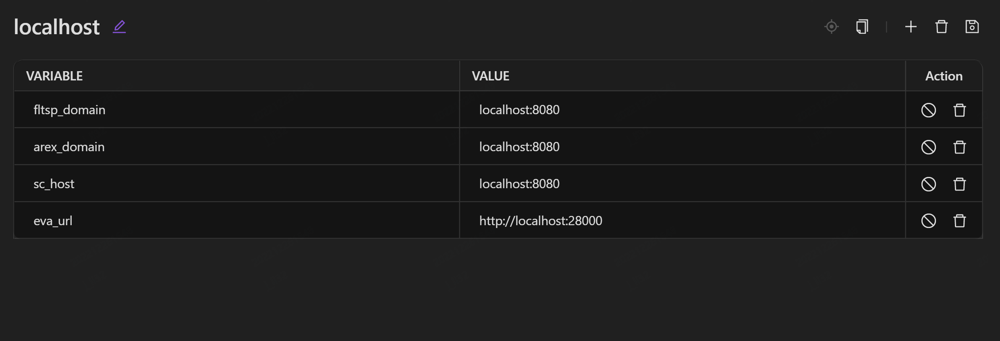

A project will be in different environments at different stages, such as development environment, test environment, and production environment. Usually, different environments have different pre-fixed URLs and different parameter values for the interfaces. Changing the pre-fixed URL and parameters frequently due to different environments is very inconvenient. Different environments can be created in AREX and different environment variables can be set in each environment. When testing in different environments, you can simply switch environments.


You can access all environments from **Environment** in the sidebar.

## Creating environments

To create a new environment, select **Environment** in the sidebar and select **+**.


Select the new environment to open the environment editor.


Select the  icon to rename this environment.

Select the  icon to make it the active environment.


Select the  icon to duplicate current environment.


### Adding environment variables

Environment variables are variables that change in response to environment switches. You can add variables to an active (currently selected) environment by opening the environment from the sidebar and editing it in the tab that opens.

You can the variable names and values inline, or use the **Disable** and **Remove** icon to disable and delete a variable. Enter the name in **VARIABLE** and values in **VALUE** for a new variable on a new line. Then select the  icon to save your changes.



## Accessing environments

You can access your environment variables from your request elements, including the URL, parameters, body data, and test scripts.

### Selecting an active environment

To use the variables in an environment, select it from the environment selector at the right corner of the workbench.


By selecting an environment through the environment selector, AREX recognizes it as the active one and executes all requests utilizing values from that environment in case your requests refer to environment variables.

To use an environment variable in a request, just reference it by name, surrounded with double curly braces like: `{{VARIABLE}}`. The system will automatically replace them with the set values during actual execution.

You can use the same variable notation in request URLs, parameters, headers, and body data. Move your cursor to a variable reference to view its value.


### Editing environment variables

You are able to edit environments in the workspace where you have **Editor** access. 

You can edit the environment name, the names and values of your variables by opening an environment from **Environments** in the sidebar.


### Setting environment variables from scripts

You can also update environment variable value via Pre-request and Tests scripts .

Use arex.environment to set an environment variable in the active (currently selected) environment:

```
arex.environment.set("variable_key", "variable_value");
```

Mind that if you write scripts to assign values to environment variables, all requests that refer to these variables will reflect the updates.
