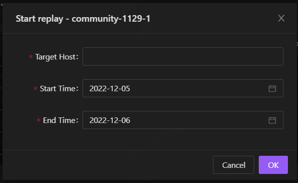
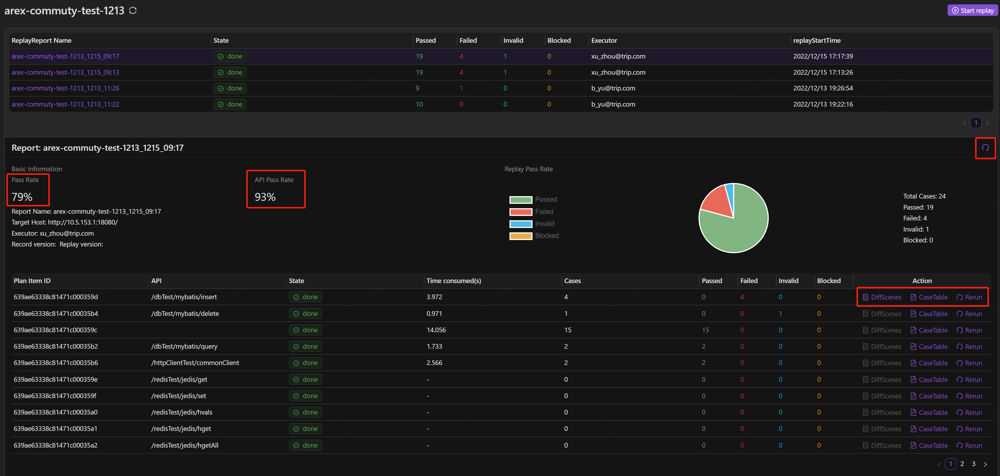

## 开始回放

应用录制并设置完成后，可以进行回放操作。

点击需要进行回放测试的应用，进入回放记录页面，工作区显示的是之前的回放结果记录。点击右上角 **Start replay**，即可进行回放。

在跳转出的窗口中依次填入本地/测试环境中需要测试的端口地址（Target Host），选择需要回放的起止日期，即可对该日期区间内录制到的线上请求进行回放。

### 回放报告

回放完成后，点击回放记录，可以查看详细的回放报告。

详细说明如下：

点击右上角 **Delete** 删除该回放报告。点击 **Run Aagin** 可以重新进行回放。

**Pass Rate**：回放用例测试通过率。(录制回放返回结果无差异视为通过)

**API Pass Rate**：接口测试通过率。

**API**：录制及回放中访问的所有接口列表。

**State**：接口测试状态，**running** 表示正在运行中，**done** 表示回放完成，**interrupted** 表示回放中断，可点击 **Rerun** 按钮重新运行测试。

**Time consumed(s)**：该接口回放测试的执行时间，单位为“s”。

**Total Cases**：该接口下测试用例的个数。

**Passed、Failed、Invalid、Blocked**：分表表示回放通过、失败、无效、中断的测试用例个数。

## 分析报文差异

接口用例中出现 **Failed** 说明回放与录制返回报文出现差异，点击右侧的 **DiffScenes**，查看差异。

左上方区域显示的是测试的主接口，下方展示的是主接口及其外部调用的第三方依赖，比如数据库等。

**Point of difference**：展示回放测试中出现的所有差异节点。对于主接口的验证，主要验证录制与回放响应报文之间的差异，对于其他外部调用的第三方依赖的验证，则通过比对其请求内容（如数据库的 sql 语句）进行验证。

**Scene Count**：出现该差异点的场景数。

**Case Count**：出现该差异点的测试用例数。

点击差异点，查看报文差异。

点击 **Tree Mode** 可以查看树形结构的差异对比。

若该出现差异的节点不需要进行比对，比如时间、IP 等和业务无关的字段，可以点击 **"Ignore Node"** 将这些节点进行忽略，提高回放效率。
